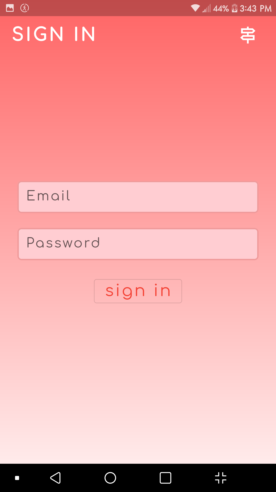
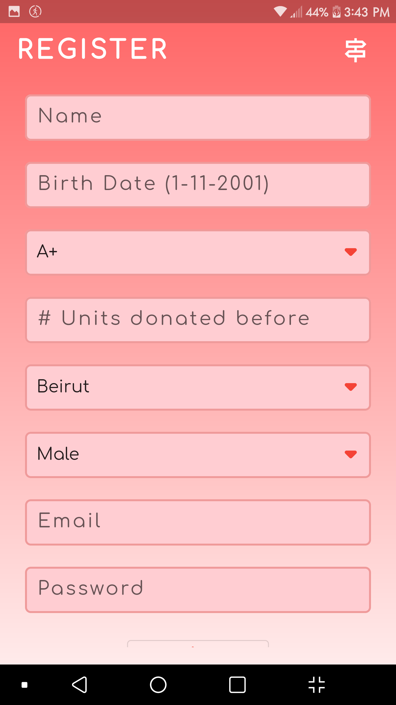
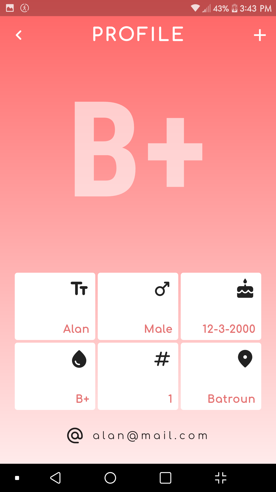
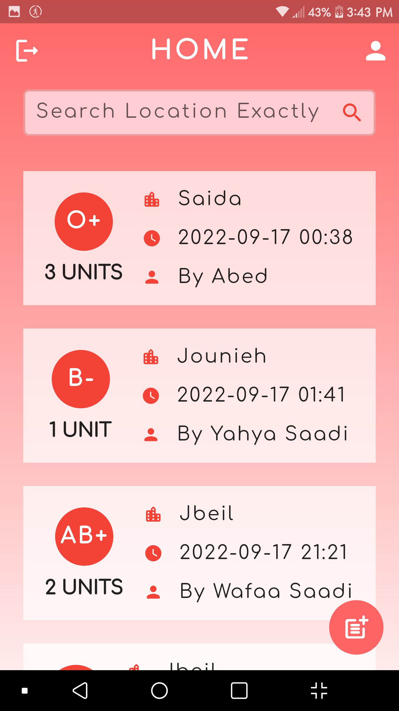
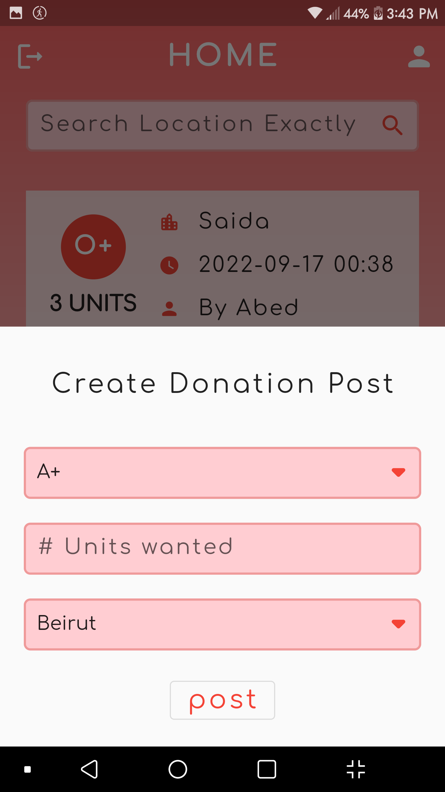

## This is a **Blood Donation App** made with Flutter

- It's made only for Lebanese Cities where I grew up
- It has a beautiful look and slick animation
- Made with firebase cloud storage and authentication
- It uses the provider package for state management
- It has a search capabilities, error handeling and loading state indicator (in case of server malfunctioning)

 

## Libraries and Packages used:
1- <a href="https://pub.dev/packages/firebase_core">firebase_core: 1.22.0</a>

2- <a href="https://pub.dev/packages/firebase_auth">firebase_auth: 3.8.0</a>

3- <a href="https://pub.dev/packages/cloud_firestore">cloud_firestore: 3.4.7</a>

4- <a href="https://pub.dev/packages/provider">provider: 6.0.3</a>

5- <a href="https://pub.dev/packages/flutter_spinkit">flutter_spinkit: 5.1.0</a>

 

## App Screenshots

| Login Page | Register Page | Profile Page |
| :-: | :-: | :-: |
||

| Main Page | Post |
| :-: | :-: |
|

 

---
`Finished on 17-Sep-22`